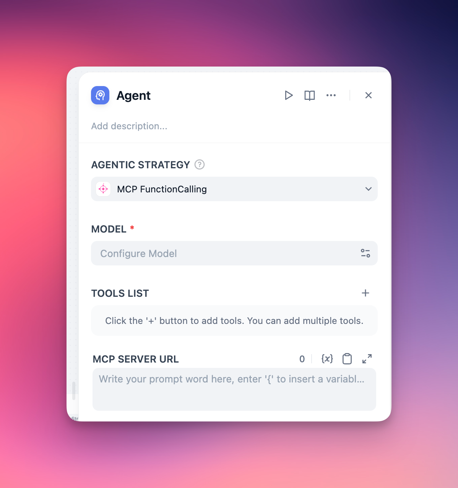

# MCP Agent Strategy

[](https://github.com/hjlarry/dify-plugin-mcp_agent)
[](https://github.com/hjlarry/dify-plugin-mcp_agent)

A Dify Agent strategy plugin that integrates MCP tool calls and common function calls capabilities.

## Features

- Full compatibility with official function call agent strategy
- Seamless integration with MCP tool calls
- Flexible MCP server connection options

## Getting Started



### Basic Configuration

For single MCP server setup, simply provide the server URL:

```shell
http://localhost:8000/sse
```

### Advanced Configuration

For multiple MCP servers with detailed connection parameters:
```json
{
  "server_name1": {
    "url": "http://127.0.0.1:8000/sse",
    "headers": {},
    "timeout": 5,
    "sse_read_timeout": 300
  },
  "server_name2": {
    "url": "http://127.0.0.1:8001/sse"
  }
}
```


## How to change MCP server from `stdio` to `sse` ?

### Option 1: source code modification
```python
if __name__ == "__main__":
    mcp.run(transport='sse')
```

### Option 2: using the [mcp-proxy](https://github.com/sparfenyuk/mcp-proxy)
```shell
uv tool install mcp-proxy
mcp-proxy --sse-host=0.0.0.0 --sse-port=8080 uvx your-server
```